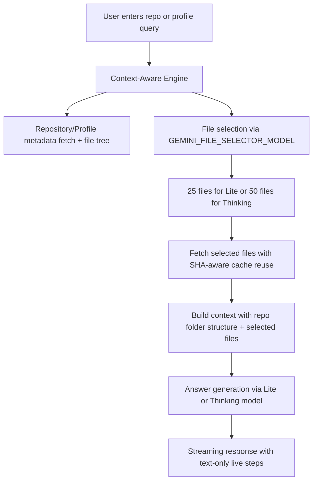
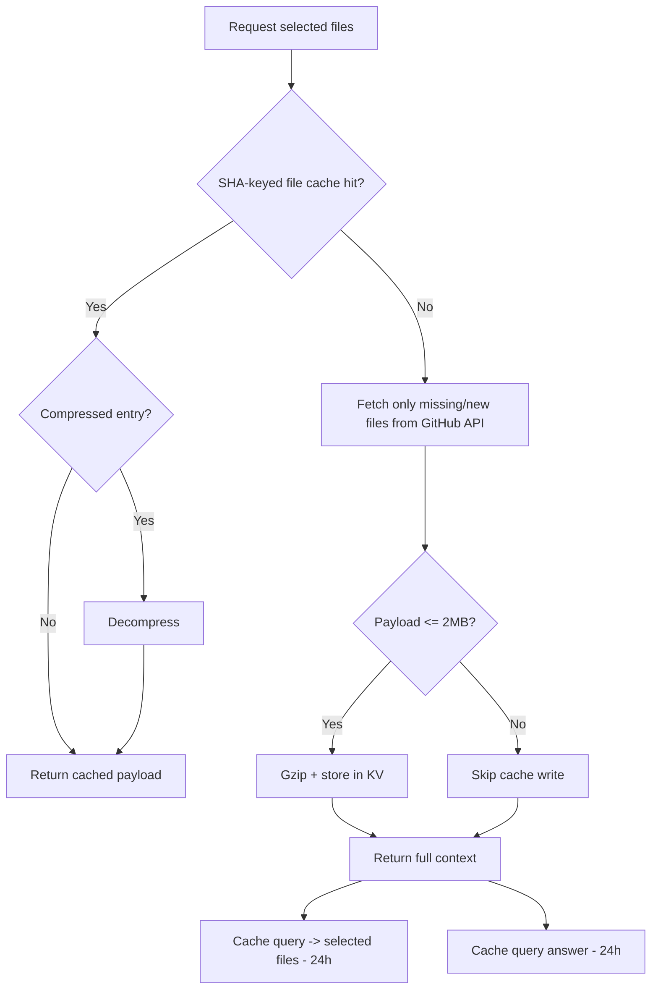
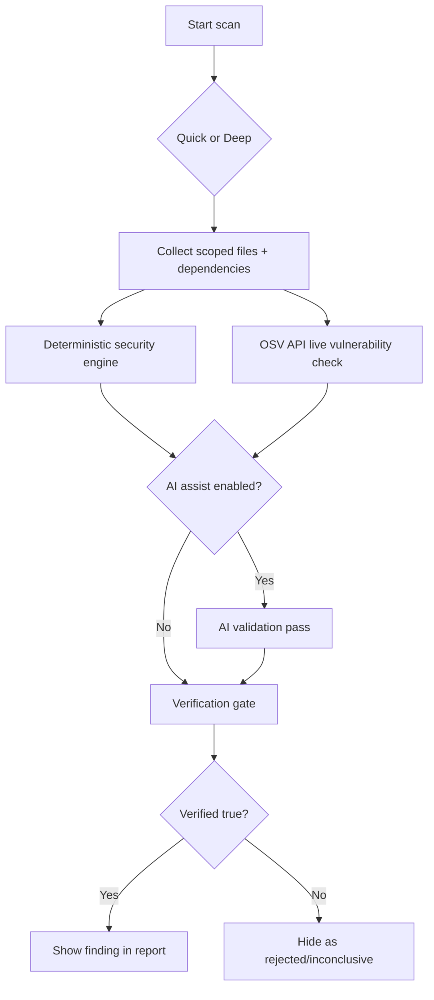
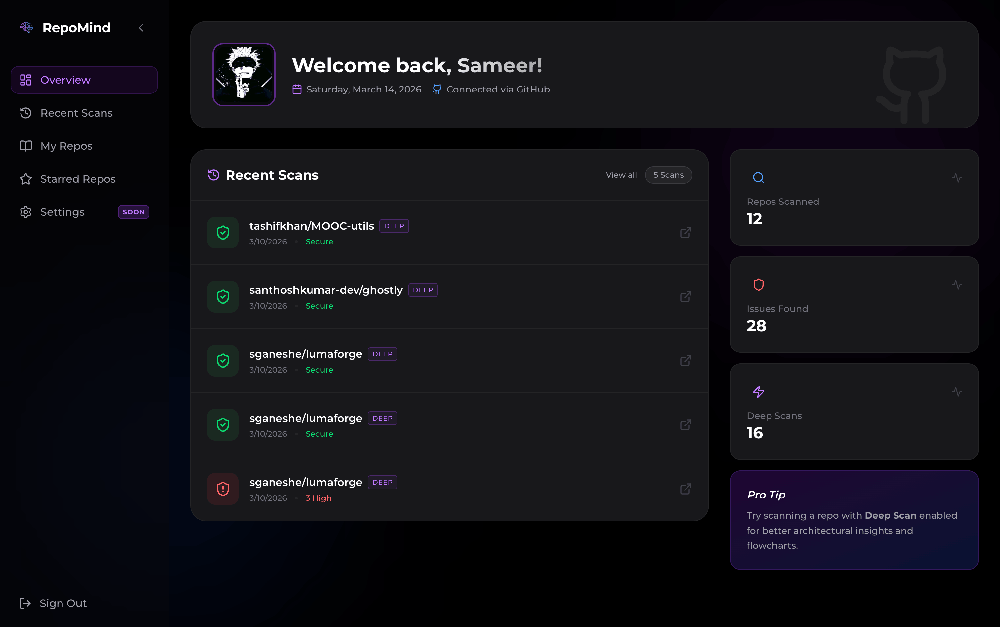
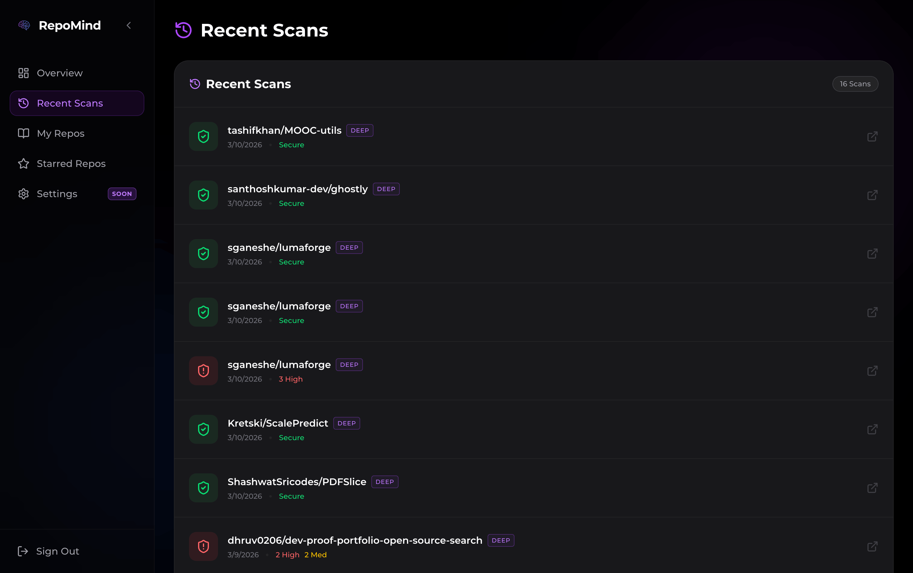
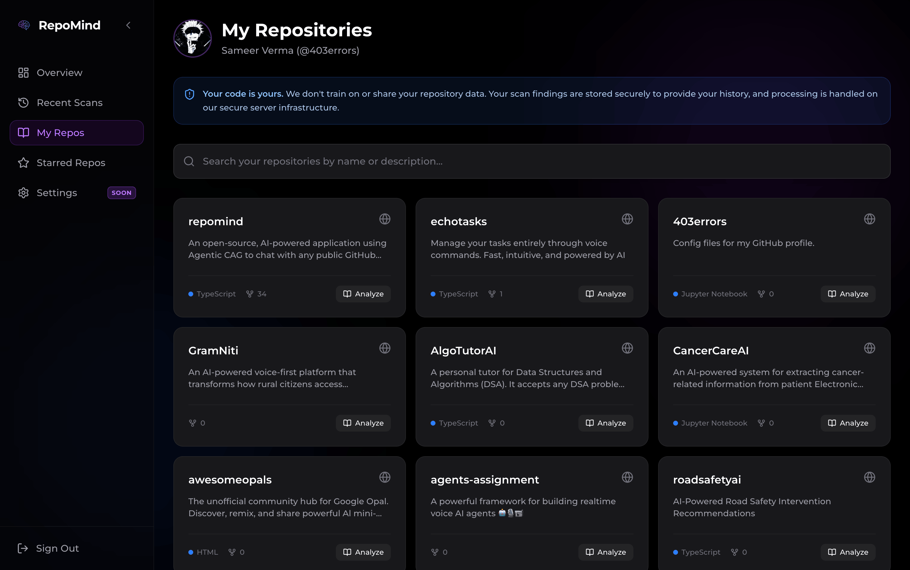

# Novaris

<p align="center"><strong>Stop reading code. Start talking to it.</strong></p>

<p align="center">
  <a href="https://github.com/singhankit001/novaris"></a>
  <a href="https://opensource.org/licenses/MIT"></a>
  <a href="https://nextjs.org/"></a>
  <a href="https://ai.google.dev/"></a>
</p>

<p align="center">
  <a href="https://novaris.in"><strong>Try Novaris Live</strong></a>
  ·
  <a href="https://novaris.in/repo/facebook/react"><strong>See React Analyzed</strong></a>
  ·
  <a href="https://github.com/singhankit001/novaris/issues"><strong>Contribute</strong></a>
</p>

[](https://www.youtube.com/watch?v=3f66xlgpjw0)

Novaris is an open-source, AI-powered platform for understanding public GitHub repositories and developer profiles with **Agentic CAG**. It combines deep code reasoning, architecture visualization, and security scanning into a fast, browser-first experience.

## Why Novaris

- **Zero setup for public repos**: paste a repo or profile and start immediately.
- **Context-aware analysis**: selects full, relevant files instead of fragmented vector chunks.
- **Visual understanding**: generates architecture maps and flow diagrams for faster onboarding.
- **Security scanning built in**: quick/deep scans with verification-focused reporting.
- **Live step feedback**: chat shows real-time processing stages (selecting files, reading files, preparing answer).
- **Contributor-friendly codebase**: clear TypeScript services, tests, and modular features.

## Product Highlights

### Landing Experience

- **Trending Repositories**: Discover popular and highly-active public repositories directly from the landing page.
- **Real-Time Global Search**: Instant, optimized repository search with auto-complete suggestions for seamless navigation.


### Repo Profile Intelligence


### Core Capabilities


## Agentic CAG Architecture

Novaris uses **Agentic Context-Augmented Generation (CAG)**. Instead of relying only on embeddings, it prunes and loads coherent source context to answer architecture and implementation questions reliably.


## Architecture Flowcharts

These diagrams provide a quick mental model of how Novaris processes queries, optimizes performance, and validates security findings.

### 1) Query + Context Pipeline



### 2) Caching + Retrieval Strategy



### 3) Security Scan + Verification Flow



## Security Scanning

Novaris includes a verification-first scanning flow for application and dependency risks.

- Quick scan for fast triage
- Deep scan for broader coverage
- **Real-time dependency checks**: Integrated with [OSV.dev API](https://osv.dev) for latest CVE data
- Verified-first reporting pipeline
- Actionable fixes inside repo chat flow


## Dashboard Experience








## Getting Started

### Use Hosted App

1. Open [novaris.in](https://novaris.in)
2. Enter `owner/repo` or a GitHub username
3. Ask architecture, code, or security questions

### Run Locally

#### Prerequisites

- Node.js 18+
- npm
- GitHub token
- Gemini API key

#### Setup

```bash
git clone https://github.com/singhankit001/novaris.git
cd novaris
npm install
cp .env.example .env.local
npm run dev
```

Open [http://localhost:3000](http://localhost:3000).

### Model Environment Variables

Repo chat now uses separate models for file selection and answer generation:

- `GEMINI_FILE_SELECTOR_MODEL` (default: `gemini-3.1-flash-lite-preview`)
- `GEMINI_LITE_MODEL` (default: `gemini-3.1-flash-lite-preview`)
- `GEMINI_THINKING_MODEL` (default: `gemini-3-flash-preview`)

### Realtime Chat Feedback

Both repo chat and profile chat stream backend activity as live text status updates (no progress bar), including:

- Selecting files
- Reading repository context
- Preparing answer
- Tool activity (for example: fetching commits, fetching repos by age, Google search usage)

### Repo Chat Commit Tooling

- `fetch_recent_commits` is available in **both Lite and Thinking** modes.
- When commit context is needed, repo chat fetches up to **latest 10 commits** for the current repository.
- Assistant messages can include:
  - `Commits checked: just now` or `cached N min ago`
  - `Tools used: ...`

### Profile Chat Tooling

- Profile chat supports anonymous and logged-in usage.
- Profile context preloads **latest 20 commits across repos**, cached for **15 minutes**.
- If a repo is explicitly asked for, tooling can fetch **latest 10 commits for that repo**.
- `fetch_repos_by_age` supports:
  - `oldest` (10 repos)
  - `newest` (10 repos)
  - `journey` (up to 20 repos, evenly spaced over repo age timeline)
- Cross-repo context is available via a chat-input toggle for logged-in users.

### Auth Tiers, Limits, and Budgets

- Anonymous users:
  - Can use Lite mode in repo/profile chat
  - Cannot use Thinking mode
  - Cannot enable cross-repo profile context
  - Tool budget: **10/day per scope** (`repo`, `profile`)
  - File-cache write budget: **10MB/day**
  - File cache TTL: **30 minutes**
  - Max cacheable file size: **128KB**, except files used in two consecutive anonymous queries (can be cached up to 2MB)
- Logged-in users:
  - Can use Lite + Thinking
  - Can enable cross-repo profile context
  - Tool budget: **30/day per scope** (`repo`, `profile`)
  - File-cache write budget: **20MB/day**
  - File cache TTL: **1 hour**

When anonymous usage limits are exceeded, UI prompts login with context-specific benefits.  
When authenticated usage limits are exceeded, chat returns a contact message for extended limits.

### Cache Isolation Rules

- Public repo file cache is shared by repository namespace.
- Private repo file cache is actor-scoped (non-shared).
- Query-to-selected-files cache TTL: **24h**
- Query answer cache TTL: **24h**

### Developer Commands

```bash
npm run dev            # local dev server
npm run lint           # lint checks
npm run test           # test suite
npm run test:security  # security-focused tests
npm run build          # production build
```

## Contributing

We want Novaris to be one of the best OSS projects for AI-assisted code intelligence. Contributions of all sizes are welcome.

### Why contribute

- Work on practical agentic AI for real repositories
- Improve developer tooling used by public users
- Ship visible features quickly with direct product impact

### High-Impact Areas

- **Query pipeline and reasoning quality**: improve file selection, prompting, and response quality
- **Security scanner and verification**: improve detection accuracy and reduction of false positives
- **Dashboard and DevTools UX**: improve discoverability, workflows, and performance
- **Docs, tests, and reliability**: strengthen onboarding and confidence for contributors

### Contribution Workflow

1. Fork the repository
2. Create a branch: `git checkout -b feature/your-change`
3. Make focused changes with tests
4. Run `npm run lint` and `npm run test`
5. Open a pull request with context, screenshots, and validation notes

### Pull Request Expectations

- Keep scope clear and reviewable
- Add or update tests when behavior changes
- Update docs when introducing user-visible changes
- Include before/after screenshots for UI work

## Changelog

Recent major updates are tracked in [CHANGELOG.md](CHANGELOG.md), including improvements through **v1.3.6 (2026-02-23)**.

## Tech Stack

- [Next.js](https://nextjs.org/)
- [React](https://react.dev/)
- [Gemini](https://ai.google.dev/)
- [OSV (Open Source Vulnerabilities)](https://osv.dev/)
- [Prisma](https://www.prisma.io/)
- [Vercel KV](https://vercel.com/docs/storage/vercel-kv)
- [Vitest](https://vitest.dev/)

## License

Licensed under the MIT License. See [LICENSE](LICENSE).

---

<p align="center">
  Built by <a href="https://github.com/singhankit001">singhankit001</a> ·
  <a href="https://github.com/singhankit001/novaris">Star on GitHub</a> ·
  <a href="https://github.com/singhankit001/novaris/issues">Report Issue</a>
</p>
